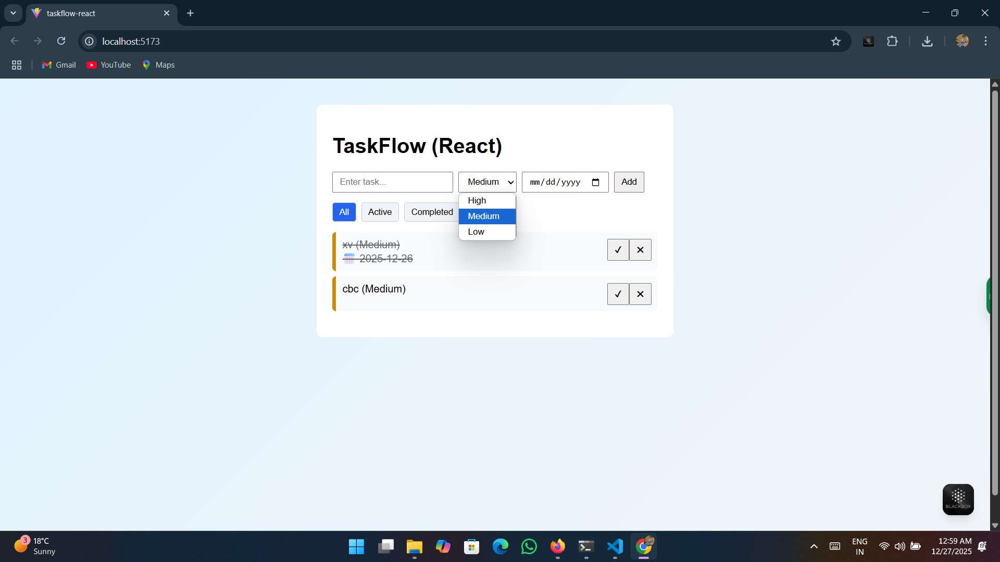
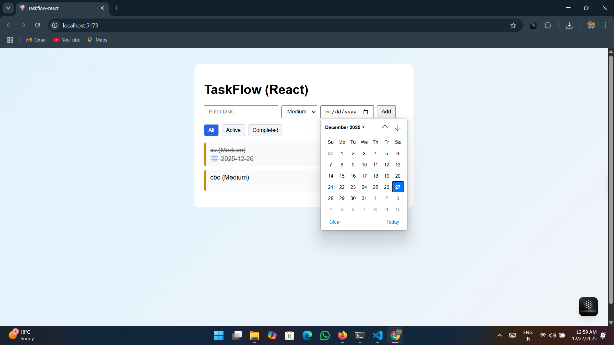
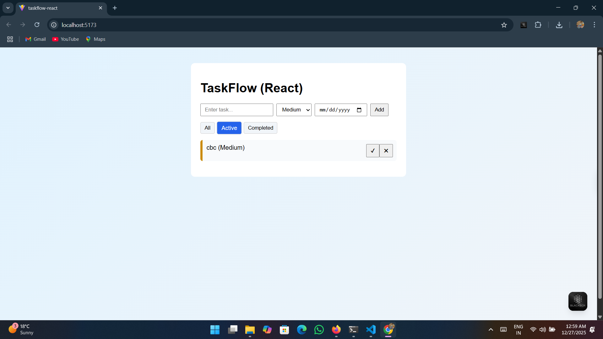
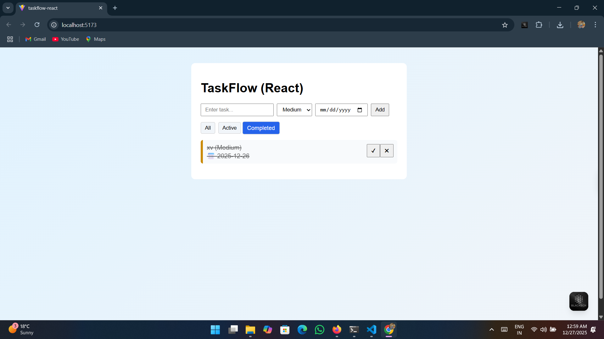

# TaskFlow (React)

TaskFlow is a clean and modern task management application built with **React + Vite**.  
This project is a React refactor of my original vanilla JavaScript TaskFlow app.

## 🚀 Live Demo
https://akashdeep4565.github.io/taskflow-react/

## ✨ Features
- Add, delete, and complete tasks
- Task priority (High / Medium / Low)
- Optional due dates
- Filter tasks (All / Active / Completed)
- Persistent data using LocalStorage
- Clean UI with animations and gradient background

## 🛠️ Tech Stack
- React (Hooks)
- Vite
- JavaScript (ES6+)
- CSS (Animations & Styling)
- GitHub Pages (Deployment)

## 📌 What I Learned
- Component-based architecture in React
- State management using `useState`
- Side effects using `useEffect`
- Derived state and filtering
- LocalStorage integration
- Deploying React apps to GitHub Pages

## 📂 Project Structure
src/
├── components/
│ ├── TaskForm.jsx
│ ├── TaskList.jsx
│ ├── TaskItem.jsx
│ └── FilterButtons.jsx
├── App.jsx
├── App.css
└── main.jsx

## 📸 Screenshots

## 🔗 Related Project
- Vanilla JS version: https://github.com/Akashdeep4565/taskflow
